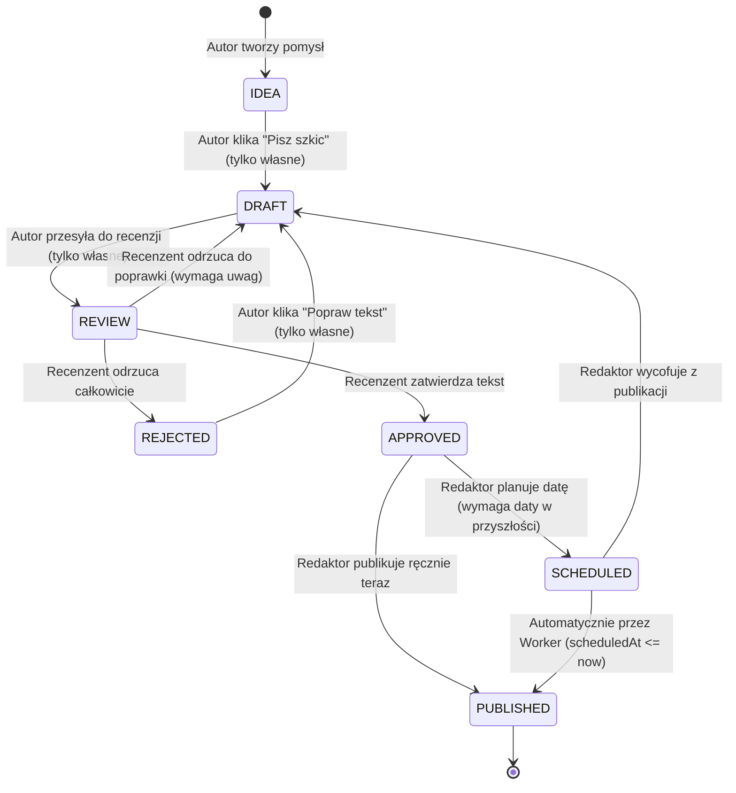

# ✍️ System Automatyzacji Pracy Redakcji i Publikacji Treści (Etap 5)

Projekt zaawansowanego systemu workflow dla małej redakcji lub zespołu contentowego, pozwalający na zarządzanie cyklem życia artykułów: od pomysłu (Idea), przez szkicowanie (Draft), recenzję merytoryczną (Review), aż po planowanie publikacji (Scheduled) i automatyczną publikację w portalu (Published).

Projekt został zrealizowany w strukturze **Monorepo** przy użyciu **npm workspaces** i zawiera szczegółowe komentarze edukacyjne w kodzie źródłowym, opisujące przepływ danych i decyzje techniczne.

---

## 🛠️ Stack Technologiczny

### Backend:
- **Core**: Node.js + Express + TypeScript
- **Baza danych & ORM**: SQLite + Prisma ORM (zapewnia bezproblemowe uruchomienie lokalne bez zewnętrznych zależności). Projekt można natychmiastowo przełączyć na PostgreSQL w pliku `schema.prisma`.
- **Komunikacja Realtime**: Socket.IO (powiadomienia o komentarzach i zmianach statusów)
- **Harmonogram zadań (Worker)**: Wbudowany w proces backendu periodyczny worker sprawdzający zaplanowane publikacje (w tle co 30 sekund).
- **Bezpieczeństwo**: Haszowanie haseł za pomocą natywnego modułu `crypto` (standard PBKDF2-SHA512) + tokeny uwierzytelniające **JWT** (JSON Web Tokens).

### Frontend:
- **Core**: React + Vite + TypeScript
- **Styling**: Nowoczesny **Vanilla CSS** (motyw jasny - light mode, płaski portalowy styl z czerwonymi akcentami, ciemny Slate Navy sidebar, pełna responsywność RWD na telefonach/tabletach, płynne mikro-animacje).
- **Biblioteka ikon**: Lucide React
- **Wykresy**: Recharts (statystyki artykułów na Dashboardzie)
- **Komunikacja z API**: Axios z interceptorem automatycznie wstrzykującym JWT Bearer Token.

---

## 📂 Architektura i Struktura Projektu

Struktura monorepo dzieli się na dwa główne pakiety deweloperskie:

```
/ (Główny katalog)
├── package.json (npm workspaces, skrypty uruchomieniowe)
├── docker-compose.yml (konfiguracja PostgreSQL i Redis do wyboru)
├── README.md (dokumentacja architektury i instrukcja)
├── .env (sekrety, zmienne środowiskowe - niewrzucany do gita)
├── .env.example (szablon zmiennych środowiskowych)
├── .gitignore (konfiguracja ignorowania folderów i sekretów)
│
├── backend/
│   ├── package.json (zależności backendu)
│   ├── tsconfig.json (ustawienia kompilatora TS)
│   ├── prisma/
│   │   ├── schema.prisma (definicja schematu bazy danych SQLite/Postgres)
│   │   └── seed.ts (skrypt automatycznego zasiedlania bazy danymi testowymi)
│   └── src/
│       ├── index.ts (bootstrap serwera Express, Socket.IO i Workera)
│       ├── routes/ (definicje endpointów API)
│       ├── controllers/ (kontrolery żądań i odpowiedzi HTTP)
│       ├── services/ (logika biznesowa - auth, artykuły, crypto)
│       ├── repositories/ (prisma client)
│       ├── middlewares/ (uwierzytelnianie JWT, checki ról, walidacja)
│       ├── validators/ (schematy Zod walidacji wejściowej)
│       ├── jobs/ (worker w tle - automatyczna publikacja)
│       └── types/ (TS enumy ról/statusów i interfejsy)
│
└── frontend/
    ├── package.json (zależności frontendu)
    ├── tsconfig.json (konfiguracja TS)
    ├── vite.config.ts (konfiguracja bundlera Vite)
    ├── index.html (entrypoint HTML, fonty Outfit i Inter)
    └── src/
        ├── main.tsx (punkt startowy Reacta)
        ├── App.tsx (router, mapowanie ścieżek, strażnicy ról)
        ├── index.css (szablon styli, kolory statusów, animacje)
        ├── context/ (globalny stan autoryzacji oraz Socket.IO/Toasts)
        ├── guards/ (AuthGuard oraz RoleGuard blokujący dostęp)
        ├── layouts/ (Layout z bocznym menu i listą powiadomień)
        ├── pages/ (Dashboard, Articles, ArticleEdit, Calendar, AdminPanel)
        ├── services/ (Axios API client)
        └── types/ (interfejsy TS)
```

---

## 🚀 Instrukcja Uruchomienia Krok Po Kroku

### 1. Klonowanie i Instalacja Zależności
Zainstaluj zależności dla całego repozytorium jednym poleceniem w głównym katalogu:
```bash
npm install
```
*Dzięki npm workspaces menedżer pakietów automatycznie zainstaluje zależności dla backendu i frontendu jednocześnie.*

### 2. Przygotowanie Bazy Danych
Projekt jest skonfigurowany pod SQLite, więc baza utworzy się lokalnie w pliku automatycznie. Wygeneruj klienta Prisma i wgraj tabele:
```bash
# W katalogu backend/ lub głównym
npx prisma db push --schema=backend/prisma/schema.prisma
```

### 3. Zasilenie Bazy Danych (Seeding)
Uruchom skrypt seedujący, który utworzy konta testowe (dla każdej roli) oraz przykładowe artykuły, komentarze i logi:
```bash
# W katalogu backend/ lub głównym
npx prisma db seed --schema=backend/prisma/schema.prisma
```

### 4. Uruchomienie Aplikacji (Backend + Frontend)
Uruchom oba serwery deweloperskie jednym skryptem z katalogu głównego:
```bash
npm run dev
```
- **Frontend** wystartuje pod adresem: `http://localhost:5173`
- **Backend** wystartuje pod adresem: `http://localhost:5000`

---

## 👥 Konta Testowe (Seeding)

Wszystkie konta posiadają to samo hasło: `password123`
- **Autor**: `author@wmedia.pl` (Może tworzyć pomysły, pisać szkice i wysyłać do recenzji)
- **Recenzent**: `reviewer@wmedia.pl` (Może recenzować artykuły w statusie REVIEW: akceptować, odrzucać lub cofać do poprawek)
- **Redaktor**: `editor@wmedia.pl` (Może planować datę publikacji artykułów APPROVED oraz publikować je ręcznie)
- **Admin**: `admin@wmedia.pl` (Może wszystko: edytować dowolne teksty, zmieniać statusy, zarządzać rolami w panelu admina)

---

## ⚙️ Workflow Redakcyjny (Maszyna Stanów)

Zaimplementowano bezpieczny mechanizm przejść statusów (State Machine) na backendzie. Każda próba zmiany weryfikuje rolę i własność artykułu:



### Reguły Bezpieczeństwa:
- **Autor** może edytować wyłącznie treść własnych artykułów (oraz tylko gdy są w statusie IDEA, DRAFT lub REJECTED). Nie może edytować cudzych artykułów ani zmieniać statusów po wysłaniu do recenzji.
- **Recenzent** nie może edytować treści tekstu (tylko dodaje komentarze), może oceniać wyłącznie teksty przesłane w statusie REVIEW.
- **Redaktor** (Editor) zajmuje się dystrybucją: planowaniem publikacji i oznaczaniem jako opublikowane.
- **Admin** posiada pełne prawa (master bypass) w celach awaryjnych.

---

## 🤖 Background Worker (Automatyzacja Publikacji)

W pliku `backend/src/jobs/worker.ts` zaimplementowano proces działający w tle serwera Node.js:
- Co **30 sekund** odpytuje bazę danych o artykuły o statusie `SCHEDULED`, których termin publikacji (`scheduledAt`) minął.
- Dokonuje transakcji: zmienia status na `PUBLISHED`, ustawia datę faktycznej publikacji (`publishedAt = now`), dodaje wpis do historii zmian statusów oraz zapisuje log aktywności systemowej.
- Tworzy powiadomienie dla autora w bazie danych.
- Wysyła sygnał realtime przez **Socket.IO** do przeglądarki autora, dzięki czemu jego panel natychmiastowo wyświetla animowany komunikat (Toast) i odświeża tablicę Kanban.

---

## 💡 Decyzje Techniczne i Rationale (Zrozumienie Kodu)

Podczas prac podjęto kilka kluczowych decyzji architektonicznych:

1. **Zastosowanie SQLite dla trybu deweloperskiego**:
   *Uzasadnienie*: Uruchomienie Dockera i pobieranie zewnętrznych obrazów PostgreSQL w zablokowanym środowisku sieciowym (sandboksie) lub na maszynach bez zainstalowanego Docker Desktop kończy się błędem (`ENOTFOUND`). SQLite działa w pliku lokalnym bez zewnętrznych instalacji, a dzięki warstwie abstrakcji Prisma, migracja na PostgreSQL produkcyjny sprowadza się wyłącznie do zmiany zmiennej `provider = "postgresql"` w pliku `schema.prisma`.
2. **Haszowanie PBKDF2 zamiast biblioteki bcrypt**:
   *Uzasadnienie*: Popularna biblioteka `bcrypt` zawiera natywne powiązania C++ (native bindings). Jej kompilacja (`node-gyp`) w systemach bez zainstalowanych narzędzi kompilacji (Visual Studio Build Tools, Python) lub w środowiskach offline (brak możliwości pobrania nagłówków Node) kończy się błędem krytycznym instalacji npm. Zastąpienie jej wbudowanym modułem `crypto` i standardem **PBKDF2-SHA512** (z 10 000 iteracji i losową solą) gwarantuje 100% niezawodność, wysokie bezpieczeństwo kryptograficzne oraz instalację paczek bez błędów.
3. **Autorski parser Markdown na frontendzie**:
   *Uzasadnienie*: Wdrożenie podglądu tekstu bez pobierania zewnętrznych bibliotek (jak react-markdown) ogranicza wielkość bundlera i uniezależnia projekt od pobierania z npm. Napisany w JavaScript parser wykorzystuje regex do konwersji najważniejszych znaczników (`#`, `##`, `**`, `*`, list `-` oraz bloków kodu \`\`\`), zapewniając bezpieczną konwersję znaków przed renderowaniem (ochrona przed XSS).
4. **WebSocket Room Routing w Socket.IO**:
   *Uzasadnienie*: Zamiast wysyłać komunikaty (broadcast) do wszystkich użytkowników o zmianie statusu (co marnuje pasmo), Socket.IO na backendzie przypisuje zalogowanych użytkowników do dedykowanych pokoi `user:${id}` oraz `role:${role}`. Pozwala to na precyzyjne kierowanie powiadomień merytorycznych wyłącznie do zainteresowanych osób (np. autor dowiaduje się o akceptacji swojego tekstu bezpośrednio).
5. **Makieta Strony Głównej Portalu (Wmedia Live)**:
   *Uzasadnienie*: Zamiast suchego panelu administracyjnego statystyk, na pulpicie głównym wdrożono interaktywny podgląd strony głównej portalu sportowego. Pobiera on w czasie rzeczywistym bazowe artykuły, dając redakcji natychmiastową symulację tego, jak ich nagłówki i zdjęcia zaprezentują się na żywo w serwisie.
6. **Wielofunkcyjny Workspace i Pełna Responsywność (RWD)**:
   *Uzasadnienie*: Przełącznik trybów podglądu (Split, Tylko edycja, Pełny podgląd) w połączeniu z responsywnym arkuszem stylów CSS rozwiązuje problem ściskania kolumn na tabletach i smartfonach, zapewniając komfortową pracę na dowolnym urządzeniu i z zachowaniem spójnej tożsamości wizualnej Wmedia.
