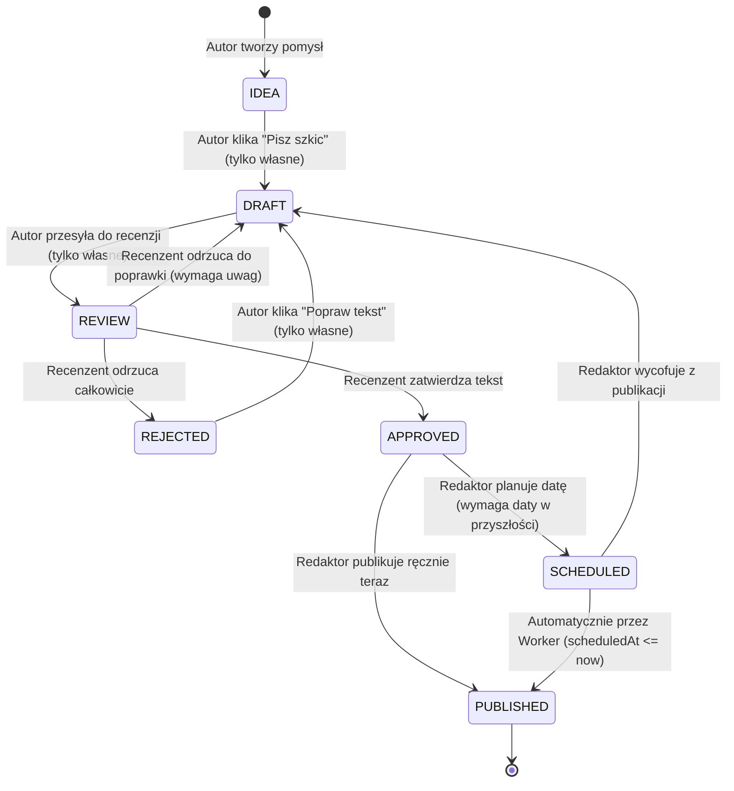
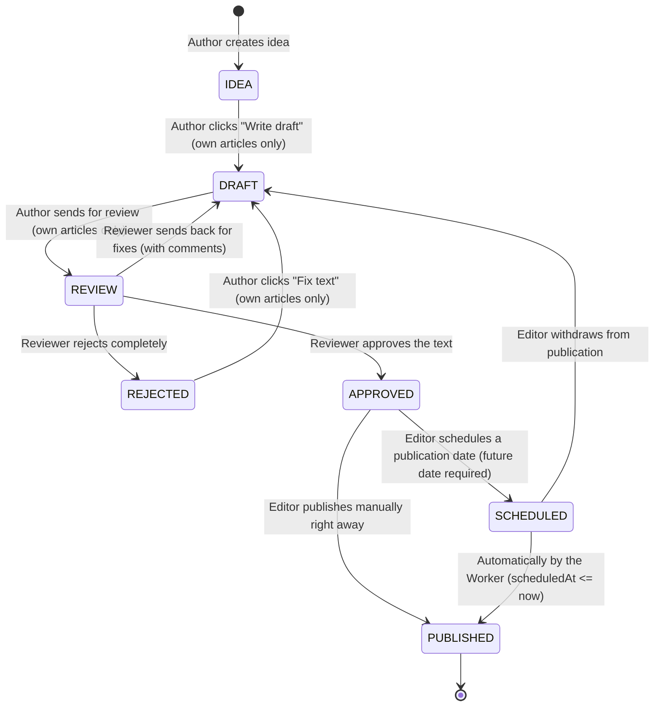

# ✍️ System Automatyzacji Pracy Redakcji i Publikacji Treści / Editorial Workflow and Content Publishing Automation System


---

# 🇵🇱 Wersja Polska

## 📌 Cel Projektu (Portfolio)
Ten projekt jest aplikacją Fullstack prezentującą moje umiejętności w tworzeniu złożonych systemów B2B. Architektura systemu obejmuje zarządzanie rolami (RBAC), obsługę WebSockets do powiadomień realtime, maszynę stanów do kontroli workflow oraz pełny frontend i backend oparty o nowoczesny stack technologiczny.

## 📖 O projekcie
Projekt zaawansowanego systemu workflow dla małej redakcji lub zespołu contentowego, pozwalający na zarządzanie cyklem życia artykułów: od pomysłu (Idea), przez szkicowanie (Draft), recenzję (Review), aż po planowanie i publikację (Scheduled / Published).

Projekt został zrealizowany w strukturze **Monorepo** przy użyciu **npm workspaces** i zawiera szczegółowe komentarze edukacyjne w kodzie źródłowym, opisujące przepływ danych i decyzje techniczne.

### Backend:
- **Core**: Node.js + Express + TypeScript
- **Baza danych & ORM**: SQLite + Prisma ORM (zapewnia bezproblemowe uruchomienie lokalne bez zewnętrznych zależności). Projekt można natychmiastowo przełączyć na PostgreSQL w pliku `schema.prisma`.
- **Komunikacja Realtime**: Socket.IO (powiadomienia o komentarzach i zmianach statusów)
- **Harmonogram zadań (Worker)**: Wbudowany w proces backendu periodyczny worker sprawdzający zaplanowane publikacje (w tle co 30 sekund).
- **Bezpieczeństwo**: Haszowanie haseł za pomocą natywnego modułu `crypto` (standard PBKDF2-SHA512) + tokeny uwierzytelniające **JWT** (JSON Web Tokens).

### Frontend:
- **Core**: React + Vite + TypeScript
- **Styling**: Nowoczesny **Vanilla CSS** (motyw jasny - light mode, płaski portalowy styl z czerwonymi akcentami, ciemny Slate Navy sidebar, pełna responsywność RWD na telefonach/tabletach, płynne animacje).
- **Biblioteka ikon**: Lucide React
- **Wykresy**: Recharts (statystyki artykułów na Dashboardzie)
- **Komunikacja z API**: Axios z interceptorem automatycznie wstrzykującym JWT Bearer Token.

---

## 📂 Architektura i Struktura Projektu

Struktura monorepo dzieli się na dwa główne pakiety deweloperskie:

```text
/ (Główny katalog)
├── package.json (npm workspaces, skrypty uruchomieniowe)
├── docker-compose.yml (konfiguracja PostgreSQL i Redis do wyboru)
├── README.md (dokumentacja architektury i instrukcja)
├── .env (sekrety, zmienne środowiskowe - niewrzucany do gita)
├── .env.example (szablon zmiennych środowiskowych)
├── .gitignore (konfiguracja ignorowania folderów i sekretów)
│
├── backend/
│   ├── package.json (zależności backendu)
│   ├── tsconfig.json (ustawienia kompilatora TS)
│   ├── prisma/
│   │   ├── schema.prisma (definicja schematu bazy danych SQLite/Postgres)
│   │   └── seed.ts (skrypt automatycznego zasiedlania bazy danymi testowymi)
│   └── src/
│       ├── index.ts (bootstrap serwera Express, Socket.IO i Workera)
│       ├── routes/ (definicje endpointów API)
│       ├── controllers/ (kontrolery żądań i odpowiedzi HTTP)
│       ├── services/ (logika biznesowa - auth, artykuły, crypto)
│       ├── repositories/ (prisma client)
│       ├── middlewares/ (uwierzytelnianie JWT, checki ról, walidacja)
│       ├── validators/ (schematy Zod walidacji wejściowej)
│       ├── jobs/ (worker w tle - automatyczna publikacja)
│       └── types/ (TS enumy ról/statusów i interfejsy)
│
└── frontend/
    ├── package.json (zależności frontendu)
    ├── tsconfig.json (konfiguracja TS)
    ├── vite.config.ts (konfiguracja bundlera Vite)
    ├── index.html (entrypoint HTML, fonty Outfit i Inter)
    └── src/
        ├── main.tsx (punkt startowy Reacta)
        ├── App.tsx (router, mapowanie ścieżek, strażnicy ról)
        ├── index.css (szablon styli, kolory statusów, animacje)
        ├── context/ (globalny stan autoryzacji oraz Socket.IO/Toasts)
        ├── guards/ (AuthGuard oraz RoleGuard blokujący dostęp)
        ├── layouts/ (Layout z bocznym menu i listą powiadomień)
        ├── pages/ (Dashboard, Articles, ArticleEdit, Calendar, AdminPanel)
        ├── services/ (Axios API client)
        └── types/ (interfejsy TS)
```

---

## 🚀 Instrukcja Uruchomienia Krok Po Kroku

### 1. Klonowanie i Instalacja Zależności
Zainstaluj zależności dla całego repozytorium jednym poleceniem w głównym katalogu:
```bash
npm install
```
*Dzięki npm workspaces menedżer pakietów automatycznie zainstaluje zależności dla backendu i frontendu jednocześnie.*

### 2. Przygotowanie Bazy Danych
Projekt jest skonfigurowany pod SQLite, więc baza utworzy się lokalnie w pliku automatycznie. Wygeneruj klienta Prisma i wgraj tabele:
```bash
# W katalogu backend/ lub głównym
npx prisma db push --schema=backend/prisma/schema.prisma
```

### 3. Zasilenie Bazy Danych (Seeding)
Uruchom skrypt seedujący, który utworzy konta testowe (dla każdej roli) oraz przykładowe artykuły, komentarze i logi:
```bash
# W katalogu backend/ lub głównym
npx prisma db seed --schema=backend/prisma/schema.prisma
```

### 4. Uruchomienie Aplikacji (Backend + Frontend)
Uruchom oba serwery deweloperskie jednym skryptem z katalogu głównego:
```bash
npm run dev
```
- **Frontend** wystartuje pod adresem: `http://localhost:5173`
- **Backend** wystartuje pod adresem: `http://localhost:5000`

---

## 👥 Konta Testowe (Seeding)

Wszystkie konta posiadają to samo hasło: `password123`
- **Autor**: `author@wmedia.pl` (Może tworzyć pomysły, pisać szkice i wysyłać do recenzji)
- **Recenzent**: `reviewer@wmedia.pl` (Może recenzować artykuły w statusie REVIEW: akceptować, odrzucać lub cofać do poprawek)
- **Redaktor**: `editor@wmedia.pl` (Może planować datę publikacji artykułów APPROVED oraz publikować je ręcznie)
- **Admin**: `admin@wmedia.pl` (Może wszystko: edytować dowolne teksty, zmieniać statusy, zarządzać rolami w panelu admina)

---

## ⚙️ Workflow Redakcyjny (Maszyna Stanów)

Zaimplementowano bezpieczny mechanizm przejść statusów (State Machine) na backendzie. Każda próba zmiany weryfikuje rolę i własność artykułu:


```mermaid
stateDiagram-v2
    [*] --> IDEA : Autor tworzy pomysł
    IDEA --> DRAFT : Autor klika "Pisz szkic" (tylko własne)
    DRAFT --> REVIEW : Autor przesyła do recenzji (tylko własne)
    REVIEW --> DRAFT : Recenzent odrzuca do poprawki (wymaga uwag)
    REVIEW --> REJECTED : Recenzent odrzuca całkowicie
    REJECTED --> DRAFT : Autor klika "Popraw tekst" (tylko własne)
    REVIEW --> APPROVED : Recenzent zatwierdza tekst
    APPROVED --> SCHEDULED : Redaktor planuje datę (wymaga daty w przyszłości)
    APPROVED --> PUBLISHED : Redaktor publikuje ręcznie teraz
    SCHEDULED --> PUBLISHED : Automatycznie przez Worker (scheduledAt <= now)
    SCHEDULED --> DRAFT : Redaktor wycofuje z publikacji
    PUBLISHED --> [*]
```

### Reguły Bezpieczeństwa:
- **Autor** może edytować wyłącznie treść własnych artykułów (oraz tylko gdy są w statusie IDEA, DRAFT lub REJECTED). Nie może edytować cudzych artykułów ani zmieniać statusów po wysłaniu do recenzji.
- **Recenzent** nie może edytować treści tekstu (tylko dodaje komentarze), może oceniać wyłącznie teksty przesłane w statusie REVIEW.
- **Redaktor** (Editor) zajmuje się dystrybucją: planowaniem publikacji i oznaczaniem jako opublikowane.
- **Admin** posiada pełne prawa (master bypass) w celach awaryjnych.

---

## 🤖 Background Worker (Automatyzacja Publikacji)

W pliku `backend/src/jobs/worker.ts` zaimplementowano proces działający w tle serwera Node.js:
- Co **30 sekund** odpytuje bazę danych o artykuły o statusie `SCHEDULED`, których termin publikacji (`scheduledAt`) minął.
- Dokonuje transakcji: zmienia status na `PUBLISHED`, ustawia datę faktycznej publikacji (`publishedAt = now`), dodaje wpis do historii zmian statusów oraz zapisuje log aktywności systemowej.
- Tworzy powiadomienie dla autora w bazie danych.
- Wysyła sygnał realtime przez **Socket.IO** do przeglądarki autora, dzięki czemu jego panel natychmiastowo wyświetla animowany komunikat (Toast) i odświeża tablicę Kanban.

---

## 💡 Decyzje Techniczne i Rationale (Zrozumienie Kodu)

Podczas prac podjęto kilka kluczowych decyzji architektonicznych:

1. **Zastosowanie SQLite dla trybu deweloperskiego**:
   *Uzasadnienie*: Uruchomienie Dockera i pobieranie zewnętrznych obrazów PostgreSQL w zablokowanym środowisku sieciowym (sandboksie) lub na maszynach bez zainstalowanego Docker Desktop kończy się problemami. SQLite zapewnia prosty start bez dodatkowej konfiguracji.
2. **Haszowanie PBKDF2 zamiast biblioteki bcrypt**:
   *Uzasadnienie*: Popularna biblioteka `bcrypt` zawiera natywne powiązania C++ (native bindings). Jej kompilacja (`node-gyp`) w systemach bez zainstalowanych narzędzi kompilacji może sprawiać problemy. PBKDF2 z modułu `crypto` jest dostępne natywnie w Node.js.
3. **Autorski parser Markdown na frontendzie**:
   *Uzasadnienie*: Wdrożenie podglądu tekstu bez pobierania zewnętrznych bibliotek ogranicza wielkość bundlera i uniezależnia projekt od pobierania z npm.
4. **WebSocket Room Routing w Socket.IO**:
   *Uzasadnienie*: Zamiast wysyłać komunikaty do wszystkich użytkowników, backend przypisuje zalogowanych użytkowników do dedykowanych pokojów, co ogranicza ruch i poprawia skalowalność.
5. **Makieta Strony Głównej Portalu (Wmedia Live)**:
   *Uzasadnienie*: Zamiast suchego panelu administracyjnego statystyk, na pulpicie głównym wdrożono interaktywny podgląd strony głównej portalu sportowego.
6. **Wielofunkcyjny Workspace i Pełna Responsywność (RWD)**:
   *Uzasadnienie*: Przełącznik trybów podglądu w połączeniu z responsywnym arkuszem stylów CSS rozwiązuje problem ściskania kolumn na tabletach i smartfonach.

---

## 🔒 Bezpieczne Kopie Zapasowe (Backupy)

Projekt zawiera zaszyfrowane pliki kopii zapasowej oryginalnych zmiennych środowiskowych `.env.backup.enc` oraz `backend/.env.backup.enc`.

Aby przywrócić oryginalne połączenie z bazą Supabase, należy rozszyfrować te pliki za pomocą skryptu pomocniczego:
```bash
node scripts/secure-backup.js decrypt <haslo>
```
*Uwaga: Hasło deszyfrujące jest prywatne i nie powinno być umieszczane w tym pliku.*

---

# 🇬🇧 English Version

## 📌 Project Goal (Portfolio)
This project is a full-stack application showcasing my skills in building complex B2B systems. The system architecture includes role management (RBAC), WebSocket support for realtime notifications, a state machine for workflow control, and a complete frontend and backend based on a modern technology stack.

## 📖 About the Project
An advanced workflow system for a small editorial team or content group, allowing management of the article lifecycle: from Idea, through Draft and Review, to scheduling and publishing (Scheduled / Published).

The project was built as a **Monorepo** using **npm workspaces** and includes detailed educational comments in the source code, describing the data flow and technical decisions.

### Backend:
- **Core**: Node.js + Express + TypeScript
- **Database & ORM**: SQLite + Prisma ORM (enables smooth local setup without external dependencies). The project can be switched to PostgreSQL immediately in `schema.prisma`.
- **Realtime Communication**: Socket.IO (notifications about comments and status changes)
- **Task Scheduler (Worker)**: A periodic worker built into the backend process that checks scheduled publications in the background every 30 seconds.
- **Security**: Password hashing with the native `crypto` module (PBKDF2-SHA512 standard) + **JWT** authentication tokens (JSON Web Tokens).

### Frontend:
- **Core**: React + Vite + TypeScript
- **Styling**: Modern **Vanilla CSS** (light mode, flat portal style with red accents, dark Slate Navy sidebar, full responsive design for phones/tablets, smooth animations).
- **Icon Library**: Lucide React
- **Charts**: Recharts (article statistics on the Dashboard)
- **API Communication**: Axios with an interceptor that automatically injects the JWT Bearer token.

---

## 📂 Project Architecture and Structure

The monorepo is divided into two main development packages:

```text
/ (Root directory)
├── package.json (npm workspaces, startup scripts)
├── docker-compose.yml (configuration for PostgreSQL and Redis as options)
├── README.md (architecture documentation and instructions)
├── .env (secrets, environment variables - not committed to git)
├── .env.example (environment variables template)
├── .gitignore (ignore rules for folders and secrets)
│
├── backend/
│   ├── package.json (backend dependencies)
│   ├── tsconfig.json (TypeScript compiler settings)
│   ├── prisma/
│   │   ├── schema.prisma (SQLite/Postgres database schema definition)
│   │   └── seed.ts (automatic test data seeding script)
│   └── src/
│       ├── index.ts (Express, Socket.IO, and worker bootstrap)
│       ├── routes/ (API endpoint definitions)
│       ├── controllers/ (HTTP request and response controllers)
│       ├── services/ (business logic - auth, articles, crypto)
│       ├── repositories/ (Prisma client)
│       ├── middlewares/ (JWT authentication, role checks, validation)
│       ├── validators/ (Zod input validation schemas)
│       ├── jobs/ (background worker - automatic publishing)
│       └── types/ (TypeScript role/status enums and interfaces)
│
└── frontend/
    ├── package.json (frontend dependencies)
    ├── tsconfig.json (TypeScript configuration)
    ├── vite.config.ts (Vite bundler configuration)
    ├── index.html (HTML entrypoint, Outfit and Inter fonts)
    └── src/
        ├── main.tsx (React entry point)
        ├── App.tsx (router, route mapping, role guards)
        ├── index.css (style base, status colors, animations)
        ├── context/ (global auth state and Socket.IO/Toasts)
        ├── guards/ (AuthGuard and RoleGuard)
        ├── layouts/ (layout with sidebar and notifications)
        ├── pages/ (Dashboard, Articles, ArticleEdit, Calendar, AdminPanel)
        ├── services/ (Axios API client)
        └── types/ (TypeScript interfaces)
```

---

## 🚀 Step-by-Step Setup Instructions

### 1. Clone and Install Dependencies
Install dependencies for the entire repository with one command in the root directory:
```bash
npm install
```
*Thanks to npm workspaces, the package manager will automatically install dependencies for both backend and frontend.*

### 2. Prepare the Database
The project is configured for SQLite, so the database file will be created locally automatically. Generate the Prisma client and push the tables:
```bash
# In the backend/ directory or in the root directory
npx prisma db push --schema=backend/prisma/schema.prisma
```

### 3. Seed the Database
Run the seeding script that creates test accounts (for each role) and sample articles, comments, and logs:
```bash
# In the backend/ directory or in the root directory
npx prisma db seed --schema=backend/prisma/schema.prisma
```

### 4. Run the Application (Backend + Frontend)
Start both development servers with one command from the root directory:
```bash
npm run dev
```
- **Frontend** will be available at: `http://localhost:5173`
- **Backend** will be available at: `http://localhost:5000`

---

## 👥 Test Accounts (Seeding)

All accounts use the same password: `password123`
- **Author**: `author@wmedia.pl` (Can create ideas, write drafts, and send them for review)
- **Reviewer**: `reviewer@wmedia.pl` (Can review articles in REVIEW status: approve, reject, or send back for fixes)
- **Editor**: `editor@wmedia.pl` (Can schedule APPROVED articles and publish them manually)
- **Admin**: `admin@wmedia.pl` (Can do everything: edit any text, change statuses, manage roles in the admin panel)

---

## ⚙️ Editorial Workflow (State Machine)

A secure status transition mechanism (State Machine) has been implemented on the backend. Every status change validates the role and article ownership:


```mermaid
stateDiagram-v2
    [*] --> IDEA : Author creates idea
    IDEA --> DRAFT : Author clicks "Write draft" (own articles only)
    DRAFT --> REVIEW : Author sends for review (own articles only)
    REVIEW --> DRAFT : Reviewer sends back for fixes (with comments)
    REVIEW --> REJECTED : Reviewer rejects completely
    REJECTED --> DRAFT : Author clicks "Fix text" (own articles only)
    REVIEW --> APPROVED : Reviewer approves the text
    APPROVED --> SCHEDULED : Editor schedules a publication date (future date required)
    APPROVED --> PUBLISHED : Editor publishes manually right away
    SCHEDULED --> PUBLISHED : Automatically by the Worker (scheduledAt <= now)
    SCHEDULED --> DRAFT : Editor withdraws from publication
    PUBLISHED --> [*]
```

### Security Rules:
- **Author** can edit only their own articles, and only when they are in IDEA, DRAFT, or REJECTED status. They cannot edit someone else’s articles or change statuses after sending them for review.
- **Reviewer** cannot edit article content (only adds comments), and can evaluate only texts submitted in REVIEW status.
- **Editor** handles distribution: scheduling publications and marking them as published.
- **Admin** has full rights (master bypass) for emergency purposes.

---

## 🤖 Background Worker (Publishing Automation)

The file `backend/src/jobs/worker.ts` contains a background process running inside the Node.js server:
- Every **30 seconds** it checks the database for articles with `SCHEDULED` status whose publication time (`scheduledAt`) has already passed.
- It performs a transaction: changes the status to `PUBLISHED`, sets the actual publication time (`publishedAt = now`), adds an entry to the status history, and writes a system activity log.
- It creates a notification for the author in the database.
- It sends a realtime signal via **Socket.IO** to the author’s browser, allowing the panel to instantly show an animated toast message and refresh the Kanban board.

---

## 💡 Technical Decisions and Rationale

During development, several key architectural decisions were made:

1. **Using SQLite for development mode**:
   *Reasoning*: Running Docker and pulling external PostgreSQL images in restricted network environments (sandbox) or on machines without Docker Desktop can cause issues. SQLite provides a simple setup without extra configuration.
2. **Using PBKDF2 instead of bcrypt**:
   *Reasoning*: The popular `bcrypt` library depends on native C++ bindings. Its compilation (`node-gyp`) can be problematic on systems without the required build tools. PBKDF2 from the `crypto` module is natively available in Node.js.
3. **Custom Markdown parser on the frontend**:
   *Reasoning*: Implementing preview without external libraries reduces bundle size and avoids npm dependency overhead.
4. **WebSocket Room Routing in Socket.IO**:
   *Reasoning*: Instead of broadcasting messages to all users, the backend assigns logged-in users to dedicated rooms, reducing traffic and improving scalability.
5. **Portal Homepage Mockup (Wmedia Live)**:
   *Reasoning*: Instead of a plain stats admin panel, the dashboard includes an interactive preview of a sports portal homepage.
6. **Multi-purpose Workspace and Full Responsiveness (RWD)**:
   *Reasoning*: The preview mode switch combined with responsive CSS solves the problem of cramped columns on tablets and smartphones.

---

## 🔒 Secure Backups

The project contains encrypted backup files of the original environment variables: `.env.backup.enc` and `backend/.env.backup.enc`.

To restore the original Supabase database connection, decrypt these files using the helper script:
```bash
node scripts/secure-backup.js decrypt <password>
```
*Note: The decryption password is private and should not be placed in this file.*
